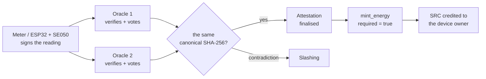
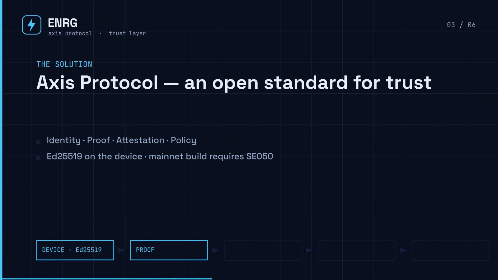
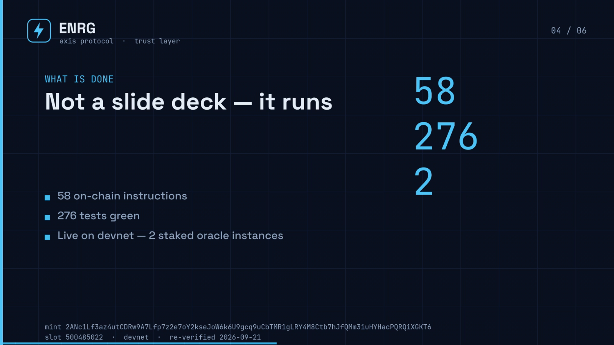

# ENRG — Energy Tokenization on Solana


ENRG is the **first application** built on the [Axis Protocol](https://github.com/AntonGrid/Axis-protocol) — an open standard for cryptographically verifiable trust between physical devices and digital systems.

ENRG focuses on the **energy domain**: it tokenizes real electricity production using cryptographic proofs from IoT devices, verifies them through oracles, and mints SRC tokens on Solana.

---

## Start here (judges, reviewers, grant teams)

**One line:** ENRG is verification infrastructure that makes physical-world data
cryptographically provable on Solana — we sell trust, not tokens.

**See it working (no setup required):**

- **Project pitch — 2:27, English, this repository:**
  [`demo/pitch-video/ENRG_pitch.mp4`](./demo/pitch-video/ENRG_pitch.mp4)
  (captions: `ENRG_pitch.srt`; the script and timings are in
  `demo/pitch-video/narration.md`; rebuild it with
  `demo/pitch-video/build.sh`)
- Live oracle + metrics — `https://enrg-oracle.onrender.com/api/v1/stats`
  (free instance: the first request may need ~30 s to wake it up)
- Program on devnet — `HkuC3FTGAf9ryPqH7fi3RbUHwP4TKFMg5WgHNWm6Vaxb`
- Technical demo (devnet walkthrough, YouTube) — `https://youtu.be/qrgdc1X9kDU`
- Submission pack — `docs/COLOSSEUM-SUBMISSION.md` · pitch storyboard —
  `docs/PITCH-VIDEO-STORYBOARD.md`

**The claims, and where to check them:**

| Claim | Evidence in this repository |
|---|---|
| Hardware root of trust | `firmware/` — ESP32 signs every proof with Ed25519, and the device identity *is* the signing key (ADR-0001). Key storage has three tiers (ADR-0007): NVS (development), ATECC608A seed vault, **NXP SE050 with on-chip Ed25519 signing** — the tier the `mainnet` build refuses to compile without |
| One oracle cannot mint | `programs/enrg-mvp` — ≥2 staked oracles vote on a canonical SHA-256 hash, a contradictory vote is a slashing event, minting is gated by a *finalised* attestation (ADR-0006) |
| Anyone can re-verify | Every proof, attestation, policy decision and mint is an inspectable Solana account |
| It is real code, not slides | 58 on-chain instructions · 276 tests green: 125 Rust (`cargo test -p enrg-mvp`), 112 Node (`npm test`), 21 Python (`pytest -q -p no:anchorpy`), 18 Foundry (`cd onchain && forge test`) |

## What runs today — and what is still pending

Written down on 2026-09-21 so that nobody has to guess which claim is
production-grade and which is a reference implementation still waiting for
hardware. If a statement here disagrees with the code, the code wins and this
table is wrong.

| Claim | Status today | Evidence, and the limit |
|---|---|---|
| 58 on-chain instructions, deployed on devnet | ✅ runs | `HkuC3FTGAf9ryPqH7fi3RbUHwP4TKFMg5WgHNWm6Vaxb`; `solana program show` |
| Minting requires a *finalised* attestation; a contradictory vote slashes | ✅ runs | mint tx `2ANc1Lf3…KT6`, slot `500485022`, `err: None` |
| ≥2 staked oracles attest the same hash | ✅ runs | two oracle **instances with separate keys** (`HC8Was…`, `Hm7Ym7…`) report through `GET /api/v1/oracles`. Both are run by me today — independence between *operators* is the next step (`docs/MULTI-ORACLE-ROLLOUT.md`), not a claim. The on-chain registry still carries 10 dev-era keys that never staked or voted; the endpoint counts them honestly (`registered: 12, with_proofs: 2, idle: 10`) and `scripts/oracle-registry-audit.ts --remove-empty` removes them once the offline `oracle_admin` key signs |
| The device signs readings with Ed25519 and the program verifies it through the precompile | ✅ runs | the devnet proofs were submitted by a device **keypair** on the host (`scripts/submit-proof-to-oracle.js`) |
| `GET /device/:id/balance` and `/device/:id/history` answer real data | ✅ runs | `EAv5ND…Fm2` → `balance: 0.000536313` SRC (`536313` atomic) from the owner's on-chain ATA `F5TGjRA1…` (owner = producer `authority`, the same account `mint_energy` checks); `/history` returns that device's proof/mint rows with `mint_status`, `mint_tx`, `oracle_id`. Before 2026-09-21 they returned `{ balance: 0 }` and `[]` |
| The key lives inside an NXP SE050 and never leaves the chip | ⚠️ **reference code written; chip never flashed; the tier does not build yet** | 141 lines of real SSS calls behind `ENRG_USE_SE050` (`sss_se05x_connect` → `sss_open_session` → `sss_key_store_init` → `sss_crypto_object_*` → `sss_asymmetric_get_pub_key` → `sss_asymmetric_sign`). Measured 2026-09-21: `pio run -e esp32dev-se050` and `-e esp32dev-mainnet` stop at an explicit `#error`, because the NXP Plug & Trust middleware is not vendored and the old `lib_deps = se050` entry never existed in the PlatformIO registry. Build matrix in `firmware/esp32_proof_sender/README.md`; vendoring steps in `SE050-HARDWARE-SIGNING.md` §Vendoring |
| A physical ESP32 has sent a proof to devnet | ⚠️ **not yet** | this is the next milestone; no bring-up log exists in this repository |
| AI layer (forecast, anomaly, federated rounds) | 🟡 sibling repo, currently a fallback | [ENRG-AI](https://github.com/AntonGrid/ENRG-AI) publishes signed `assessments.json`; the live file reports `"source": "offline-fallback"` (Holt trend, not a trained round). The on-chain `commit_contribution` (proof-of-intelligence) instruction exists and is not yet used in production |
| 276 tests green | ✅ measured 2026-09-21 | 125 Rust / 112 Node / 21 Python / 18 Foundry. Note: the Python suite is mock-level **simulation** of the tokenomics math, not a verification of the Rust implementation, and the Foundry suite covers the EVM attestation sink, not the Solana program |

## Verify it yourself in two minutes

| # | Check | How |
|---|---|---|
| 1 | The oracle answers | `curl -s https://enrg-oracle.onrender.com/api/v1/stats` — free instance, so the first call may return `503` while it wakes: retry a few seconds later. Captured 2026-09-21: `total_proofs 22`, `minted_proofs 15`, `active_producers 8`, `attestation_rows 28`, `total_energy_wh 31015` |
| 2 | A mint that passed the gate | [`2ANc1Lf3…KT6`](https://explorer.solana.com/tx/2ANc1Lf3az4utCDRw9A7Lfp7z2e7oY2kseJoW6k6U9gcq9uCbTMR1gLRY4M8Ctb7hJfQMm3iuHYHacPQRQiXGKT6?cluster=devnet) — devnet, **slot 500485022**, `err: None`, 31 program logs |
| 3 | A third party earned the mint | [`3VzmRDVq…9ofB`](https://explorer.solana.com/tx/3VzmRDVqcNqRdNX8vAPo3wCcLwJXL6LPR1kKhkNaYrHn3KHjZSSHXgzR27BVdRAynVWaipUrjdNC4RRi4eA69ofB?cluster=devnet) — an owner that did **not** sign the mint received the SRC |
| 4 | The program is deployed | `HkuC3FTGAf9ryPqH7fi3RbUHwP4TKFMg5WgHNWm6Vaxb` on devnet (`solana program show …`) |
| 5 | The rules are in the code | `programs/enrg-mvp/src/instructions/mint_energy.rs` + the policy engine it executes |
| 6 | The API spec matches the code | `npm run openapi:check` — `docs/openapi.json` is generated from `server.js`, and the check fails if a route was added, renamed or removed without updating the spec (CI runs it on every push) |

## The trust path

```text
Device → Proof → Oracle → Attestation → Smart Contract → SRC Token
```



One compromised oracle cannot create value: minting needs a **finalised**
attestation, and a contradictory vote is a slashing event.

Two frames from the pitch video — the trust path, and what is already running on
devnet (`docs/assets/`, rendered from `demo/pitch-video/ENRG_pitch.mp4`):





---

**Five-minute reading order:** `docs/POSITIONING.md` (what we are) →
`docs/COMPETITORS.md` (who else is in this space) → `docs/STATE.md` (what is
implemented) → `docs/MULTI-ORACLE-ROLLOUT.md` (how an independent operator joins)
→ `MAINNET-CHECKLIST.md` (what remains before mainnet).

---

## What ENRG Does

ENRG connects physical energy producers (solar panels, wind turbines, meters) to the Solana blockchain.

- **Device** — measures energy, signs data with Ed25519, sends Proof to Oracle.
- **Oracle** — verifies signatures, accumulates data, calls smart contract.
- **Smart Contract** — mints SRC tokens based on verified energy production.
- **Owner** — receives tokens proportional to produced energy.

---

## Ecosystem

ENRG is **Layer 2** of the Axis ecosystem — the first domain profile (energy),
living proof that the trust standard works on real hardware.
One map of all layers: [**Ecosystem map**](https://github.com/AntonGrid/Axis-protocol/blob/main/docs/ECOSYSTEM.md) ·
[**Constitution**](https://github.com/AntonGrid/Axis-protocol/blob/main/docs/CONSTITUTION.md) ·
[**Glossary**](https://github.com/AntonGrid/Axis-protocol/blob/main/docs/GLOSSARY.md).

| Layer | Repo |
|---|---|
| L0 Standard | [Axis-protocol](https://github.com/AntonGrid/Axis-protocol) |
| L1 Reference implementation | [Axis-core](https://github.com/AntonGrid/Axis-core) |
| **L2 Domain profile (energy)** | **ENRG (this repo)** |
| L3 Intelligence | [ENRG-AI](https://github.com/AntonGrid/ENRG-AI) |
| L4 Interfaces | [enrg-landing](https://github.com/AntonGrid/enrg-landing) · [Axis-connect](https://github.com/AntonGrid/Axis-connect) |

---

## Mainnet readiness (audit 2026-08-30)

Before the mainnet launch, follow in order:

1. **[`MAINNET-CHECKLIST.md`](./MAINNET-CHECKLIST.md)** — the hard
   requirements tracker (all technical items closed by the audit).
2. **[`docs/MAINNET-RUNBOOK.md`](./docs/MAINNET-RUNBOOK.md)** — the step-by-step
   deployment runbook (key ceremony → deploy → bootstrap → oracle → firmware → AI).
3. **[`docs/MAINNET-GOVERNANCE.md`](./docs/MAINNET-GOVERNANCE.md)** — how to
   move the protocol authorities to a Squads multisig.
4. **`scripts/rotate-keys.sh`** — generate FRESH keys (the founder key leaked
   at `d3664c1` is compromised and must be rotated).
5. **`scripts/transfer-authorities-to-squads.ts`** — transfer vault / policy /
   oracle-registry / governance members to the multisig.

## Positioning & funding

- **[`docs/POSITIONING.md`](./docs/POSITIONING.md)** — how we describe ENRG:
   *cryptographic trust between the physical and digital worlds* (audit,
   certificates, ESG, DePIN) — use for any pitch/deck/application.
- **[`docs/COMPETITORS.md`](./docs/COMPETITORS.md)** — who we compete with in
   DePIN on Solana: four rings, live-product statuses, exposure analysis and a
   quarterly refresh procedure.
- **[`docs/ONEPAGER.md`](./docs/ONEPAGER.md)** — one-page handout for people.
- **[`docs/GRANTS.md`](./docs/GRANTS.md)** — funding plan (Solana, peaq, Filecoin,
   Gitcoin, IoTeX) + copy-paste application template.

---

## Repository Structure

The live path is deliberately small. Everything that used to sit in the root and
did not run is now in `legacy/` with its status written down (`legacy/README.md`).

- `programs/` — Solana programs (Anchor/Rust): `enrg-mvp` (58 instructions) and
  `enrg-profile` (domain profile).
- `server.js`, `storage.js`, `policy.js` — the live oracle API (Express), its
  storage (Postgres/SQLite) and the policy engine.
- `onchain/` — the EVM attestation sink (`EnrgOracleAttestation.sol` + 18 Foundry
  tests) — **the only Solidity source**; the stale `contracts/` copy was removed
  on 2026-09-16.
- `firmware/` — ESP32 firmware (`esp32_proof_sender`) and `firmware/updates/` (OTA images).
- `oracle/` — the manifest registry microservice (docker-compose service).
- `scripts/` — the maintained lifecycle/bridge scripts (TypeScript + Python).
- `tests/` — the suites CI gates on: `tests/*.test.js` (mocha), `tests/**/*.test.ts`,
  `tests/test_*.py` (pytest); `tests_disabled/` is explicitly switched off.
- `schemas/` — JSON Schemas for the core artefacts (proof, manifest, record, attestation).
- `examples/` — runnable example payloads (the early ones are in `legacy/examples/`).
- `idls/`, `vendor/` — Anchor IDL exports and the vendored `anchor-spl` patch.
- `docs/` — specifications, ADRs, audits and runbooks; `docs/STATE.md` is the
  current state of the world.
- `demo/` — demo script, captions and the reproducible pitch-video pipeline.
- `legacy/` — earlier designs and app-shaped code, clearly labelled as not live.

---

## Quick Start

### Prerequisites

- [Solana CLI](https://docs.solana.com/cli/install-solana-cli-tools)
- [Anchor](https://www.anchor-lang.com/docs/installation)
- [Node.js](https://nodejs.org/) (v18+)
- [Python 3.10+](https://www.python.org/)
- [Foundry](https://book.getfoundry.sh/getting-started/installation) (for on-chain tests)

### Clone and Install

```bash
git clone --recurse-submodules https://github.com/AntonGrid/ENRG.git
cd ENRG
# already cloned without --recurse-submodules? then run:
#   git submodule update --init landing

# Install Node.js dependencies
npm install

# Install Python dependencies
pip install -r requirements.txt

# Install Anchor dependencies
cd programs && anchor build && cd ..
```

### Run Oracle

```bash
node server.js
```

### Run Tests

```bash
# Node suites (hermetic, 112 tests, no validator): policy, conformance, mint,
# manifest, firmware, key rotation, oracle quorum, webcrypto, storage queue
npm test

# TypeScript suite that needs a live cluster (local validator or devnet)
npm run test:integration

# Rust: program + integration tests (125 tests, incl. the policy conformance vectors)
cargo test -p enrg-mvp

# Python: tokenomics and mainnet-critical simulations
pytest -q -p no:anchorpy

# Foundry
cd onchain && forge test
```

The local-validator Python scripts now live in `legacy/local-validator/`
(`bootstrap_protocol.py`, `integration_mint_energy.py`). They are manual tools,
not pytest modules: `solana-test-validator` + `anchor deploy`, then
`python legacy/local-validator/integration_mint_energy.py`.
The devnet end-to-end proofs are `npm run devnet:e2e` and
`npx ts-node scripts/devnet_mint_third_party.ts`.

## Architecture

ENRG follows the Axis Protocol trust pipeline:

```text
Device → Proof → Oracle → Attestation → Smart Contract → SRC Token
```

## Components

| Component | Responsibility |
| :--- | :--- |
| Device | Measures energy, signs Proof with Ed25519. |
| Oracle | Verifies signatures, accumulates data, calls mint. |
| Smart Contract | Mints SRC tokens based on verified Proofs. |
| Owner | Receives tokens proportional to energy produced. |

> **Who signs the mint (since 2026-09-16).** `mint_energy` accepts the device owner
> *or* the oracle that signed the report as the submitter, and always credits
> `producer.authority` (the device owner). The mint transaction passes one extra
> account, `producerOwner` (= `producer.authority`, **not** a signer), used only to
> derive the `[b"profile", owner]` PDA in the `enrg-profile` CPI. The reference
> oracle signs the mint with its own key, so a device claimed by a user wallet
> earns for that user. See `docs/OWNERSHIP-FIX-2026-09-16.md`.

## Relationship with Axis Repositories

- **Axis-protocol** — the normative specification of the trust standard.
- **Axis-core** — the universal reference implementation of the protocol.
- **ENRG** (this repository) — the first application on Axis, focused on energy tokenization on Solana.

## Contributing

Contributions are welcome! Please read:

- [CONTRIBUTING.md](./CONTRIBUTING.md) — guidelines for PRs and coding standards.
- [SECURITY.md](./SECURITY.md) — for reporting security issues.
- [CODE_OF_CONDUCT.md](./CODE_OF_CONDUCT.md) — community standards.

## License

MIT © 2026 Anton Gulda (see [LICENSE](./LICENSE) — the file is the authoritative text)
